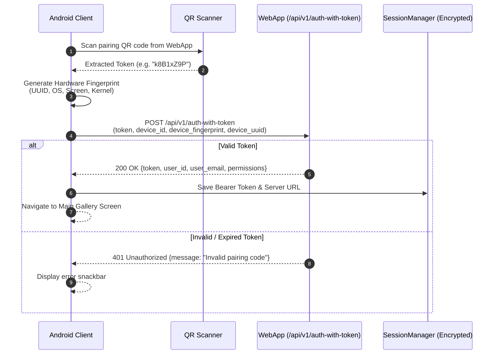
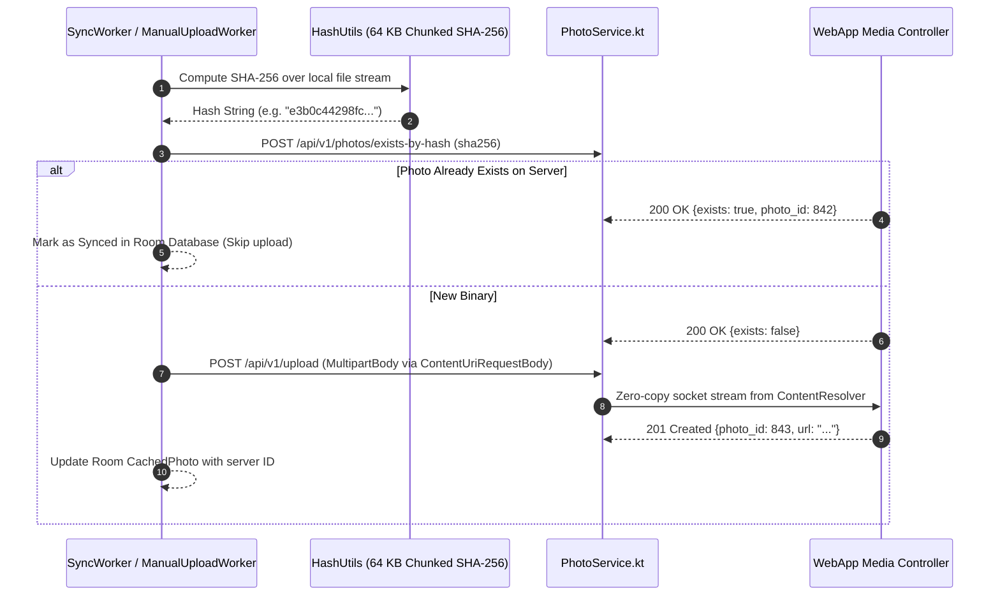

# Network & API Communication — Chege Photos Android

This document details the network architecture, REST API endpoints, authentication flows, and offline sync sequences between the Android app and the Chege Photos WebApp backend.

---

## 1. Network Stack & Client Architecture

The networking layer is implemented using **Retrofit 2** and **OkHttp 3** inside [ApiClient.kt](../../app/src/main/java/com/niccher/chege_photos_app/network/ApiClient.kt).

* **Base URL**: Dynamic, configured via `SessionManager.getServerUrl()` and validated on app launch.
* **Authentication Interceptor**: Injects `Authorization: Bearer <token>` into all outbound requests once the device is paired.
* **Custom User-Agent**: Transmits device OS version and client build number.
* **Timeouts**: 30 seconds for standard queries; extended to 120 seconds for multipart media uploads.

---

## 2. Pairing & Authentication Handshake

When pairing via QR code or manual token entry, the client binds the physical hardware to the user session using [DeviceFingerprint.kt](../../app/src/main/java/com/niccher/chege_photos_app/utils/DeviceFingerprint.kt).

---

## 3. High-Performance Deduplication & Upload Sequence

Before transmitting multi-megabyte media files across cellular or Wi-Fi networks, the client performs instant client-side binary deduplication:

---

## 4. REST Endpoint Matrix

| Method | Endpoint | Description |
|---|---|---|
| `GET` | `/api/v1/config` | Retrieves server capabilities, version, and supported mime types. |
| `GET` | `/api/v1/test` | Lightweight connectivity ping. |
| `POST` | `/api/v1/login` | Traditional email and password authentication. |
| `POST` | `/api/v1/auth-with-token` | Pairing handshake using desktop-generated QR token and hardware fingerprint. |
| `GET` | `/api/v1/photos` | Fetches paginated remote photo metadata with optional sort/query. |
| `GET` | `/api/v1/albums` | Lists user albums with cover photo thumbnails. |
| `GET` | `/api/v1/albums/{id}/photos` | Fetches photos associated with a specific album. |
| `GET` | `/api/v1/memories` | Retrieves "On This Day" anniversary photos. |
| `GET` | `/api/v1/favorites` | Fetches starred/favorited photos. |
| `GET` | `/api/v1/archive` | Fetches archived photos. |
| `GET` | `/api/v1/trash` | Fetches soft-deleted items pending purge. |
| `GET` | `/api/v1/explore` | Fetches categorized entities, locations, and tags. |
| `POST` | `/api/v1/photos/exists-by-hash` | Fast deduplication check using chunked SHA-256 hash. |
| `POST` | `/api/v1/upload` | Multipart streaming media upload (`file`, `deviceId`, `fingerprint`). |
| `POST` | `/api/v1/photos/delete/{id}` | Soft-deletes a photo to trash. |
| `POST` | `/api/v1/photos/restore/{id}` | Restores a photo from trash. |
| `POST` | `/api/v1/photos/empty-trash` | Permanently purges all trashed items. |

---

## Related Documentation

* [Architecture Overview](overview.md)
* [Data & Storage Models](data-and-storage.md)
* [Streaming Uploads & WorkManager](../services/android.md)
* [Testing Network & Mocks](../engineering/testing.md)
