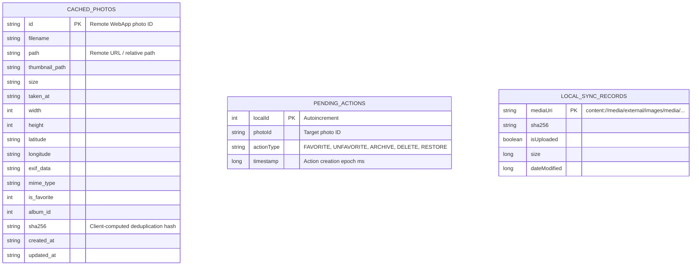

# Data & Storage Architecture — Chege Photos Android

This document defines the local persistence architecture of the Chege Photos Android app, including Room SQLite entities, DAOs, Android Scoped Storage integration, and MediaStore scanning.

---

## 1. Room SQLite Database (`PhotoDatabase`)

The application uses [Room Database](../../app/src/main/java/com/niccher/chege_photos_app/data/PhotoDatabase.kt) to maintain an offline cache of the remote library, track local upload progress, and queue offline user operations.



### Table Definitions

#### A. `cached_photos`
* **Purpose**: Local representation of remote photos fetched from `/api/v1/photos`.
* **Queries**: Filtered by date (`ORDER BY taken_at DESC`), favorite state, or album ID. Reactive updates propagate to Compose screens via Kotlin coroutine `Flow<List<CachedPhoto>>`.

#### B. `pending_actions`
* **Purpose**: Offline mutation queue. When a user marks a photo as favorite or moves it to trash while disconnected, an `OfflineAction` record is appended.
* **Drain Logic**: When network connectivity is restored, `OfflineSyncWorker` replays pending actions against the WebApp and clears them upon HTTP 200 confirmation.

#### C. `local_sync_records`
* **Purpose**: Tracks on-device photos discovered via Android `MediaStore`.
* **Fields**: Tracks `mediaUri`, computed `sha256`, and whether the image has been uploaded to avoid redundant network requests.

---

## 2. MediaStore & Android Scoped Storage

Starting in Android 10 (API 29), direct raw filesystem paths (`/sdcard/DCIM/`) are restricted by Android's **Scoped Storage** sandbox.

### Querying Local Device Media
The app queries the Android MediaStore content provider via `ContentResolver`:
```kotlin
val projection = arrayOf(
    MediaStore.Images.Media._ID,
    MediaStore.Images.Media.DISPLAY_NAME,
    MediaStore.Images.Media.DATE_TAKEN,
    MediaStore.Images.Media.SIZE
)
val cursor = context.contentResolver.query(
    MediaStore.Images.Media.EXTERNAL_CONTENT_URI,
    projection,
    null,
    null,
    "${MediaStore.Images.Media.DATE_TAKEN} DESC"
)
```

Photos and videos are accessed strictly via `content://` URIs, which are subsequently streamed via Okio without copying the entire binary to the app's internal private cache.

---

## 3. Image Caching (Coil Compose)

Coil manages asynchronous image loading, downsampling, and disk caching:
* **Memory Cache**: 25% of available JVM heap dynamically sized based on device capabilities.
* **Disk Cache**: 250 MB LRU disk cache residing in `context.cacheDir/image_cache`.
* **Crossfade Animation**: Enabled by default with 200ms duration for seamless grid rendering.

---

## Related Documentation

* [Architecture Overview](overview.md)
* [Network & Communication](communication.md)
* [Streaming & Background Services](../services/android.md)
* [Database Migrations & Changes](../engineering/making-changes.md)
