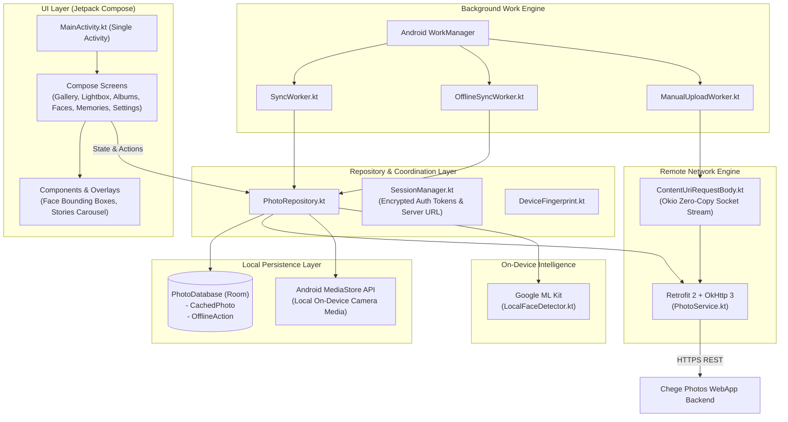

# Architecture Overview — Chege Photos Android

The Chege Photos Android companion application is designed using modern Android architecture principles: a single-activity architecture, 100% Jetpack Compose UI, unidirectional data flow (UDF), and an offline-first repository pattern backed by Room and WorkManager.

---

## High-Level Architecture Diagram

---

## Architectural Layers

### 1. Presentation Layer (Jetpack Compose)
* **Single Activity**: `MainActivity` hosts all navigation states and screen composables.
* **Declarative Navigation**: Transitions between gallery grids, albums, search, face clusters, and full-screen image viewers are driven by Kotlin state hoisting.
* **Edge-to-Edge Insets**: Proper handling of `WindowInsetsCompat` and `statusBarsPadding()` ensures photos and action bars gracefully avoid hardware notches and camera cutouts.

### 2. Repository Layer (`PhotoRepository`)
* Serves as the single source of truth for the UI.
* Transparently merges server photos from Retrofit with local on-device images queried from Android's `MediaStore`.
* Automatically commits user actions (favoriting, deleting) to the Room database first for instantaneous UI responsiveness before scheduling background sync.

### 3. Background Synchronization (`WorkManager`)
* Coordinates deferred background synchronization respecting system constraints (Wi-Fi connected, battery not low, device idle).
* Survives app terminations and device reboots.

### 4. Zero-Copy Upload Streaming (`ContentUriRequestBody`)
* Directly bridges Android `ContentResolver` input streams to OkHttp network sockets via Okio.
* Prevents reading multi-gigabyte 4K video files or RAW images into JVM heap memory, completely eliminating Out-Of-Memory (OOM) crashes.

---

## Related Documentation

* [Inter-Service Communication & API Contracts](communication.md)
* [Data & Persistence Architecture (Room & MediaStore)](data-and-storage.md)
* [Android Services, WorkManager & Streaming](../services/android.md)
* [Making Changes & Adding Screens](../engineering/making-changes.md)
