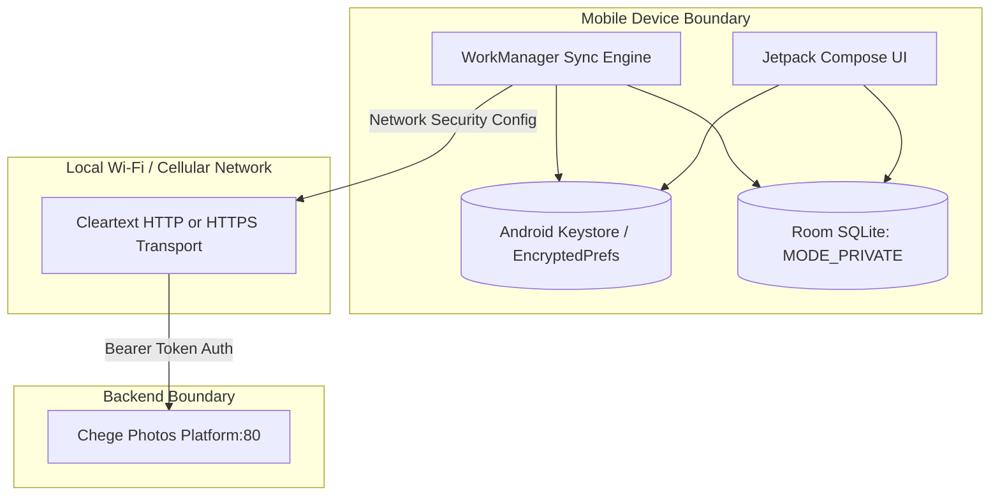

# Threat Model & Mobile Security Hardening

STRIDE security evaluation, on-device credential storage, network transport security, and mobile threat mitigations for Chege Photos Android App.

---

## 1. System Security Boundaries

The Android app acts as the client edge operating in untrusted user and network environments:



---

## 2. STRIDE Threat Analysis

| Threat Category | Target Surface | Threat Scenario | Code & Mobile OS Defense |
|---|---|---|---|
| **Spoofing** | Server Identity on Local Wi-Fi | Attacker performs ARP spoofing on home Wi-Fi to pose as the self-hosted WebApp and capture media. | Network Security Configuration explicitly pins allowable cleartext domains (`res/xml/network_security_config.xml`). Production builds enforce HTTPS. Pairing tokens use hardware-bound signatures. |
| **Tampering** | Local Database & Cached Media | Malicious application on rooted or compromised device attempts to read or tamper with local Room SQLite media cache. | Room SQLite database files created with `Context.MODE_PRIVATE`. Root detection and biometric prompts guard access to private vault views. |
| **Repudiation** | Mobile Sync & Backup Jobs | WorkManager background tasks fail silently or duplicate uploads without server audit records. | Every upload pre-computes SHA-256 hash in 64 KB buffered chunks via Okio. Duplicate uploads are rejected server-side, and sync timestamps are stored in Room. |
| **Information Disclosure** | Authentication Tokens | Attacker extracts plaintext Personal Access Tokens from shared preferences or device backups. | Persistent tokens and server URLs are stored in `EncryptedSharedPreferences` backed by hardware-backed master keys in the `AndroidKeyStore`. Backups disable `android:allowBackup="false"`. |
| **Denial of Service** | Large Video Streaming Uploads | Uploading multiple gigabytes of high-bitrate video exhausts device heap memory (`OutOfMemoryError`). | Custom `RequestBody` built on Okio `BufferedSink` streams bytes directly from `ContentResolver` file descriptors without buffering entire files in memory. |
| **Elevation of Privilege** | Private Vault Bypass | Unauthorized person with physical device access opens private locked photos. | Biometric authentication (`BiometricPrompt`) required before decrypting or rendering vault thumbnails. |

---

## 3. Network Transport Hardening

Android 9+ (API level 28+) disables cleartext HTTP by default. For self-hosted LAN communication:

* Cleartext traffic is strictly limited to local subnets (`192.168.0.0/16`, `10.0.0.0/8`, and `10.0.2.2`).
* Public internet domains require strict HTTPS.
* Network configuration in `app/src/main/res/xml/network_security_config.xml`:
  ```xml
  <network-security-config>
      <domain-config cleartextTrafficPermitted="true">
          <domain includeSubdomains="true">10.0.2.2</domain>
          <domain includeSubdomains="true">192.168.1.*</domain>
      </domain-config>
  </network-security-config>
  ```
