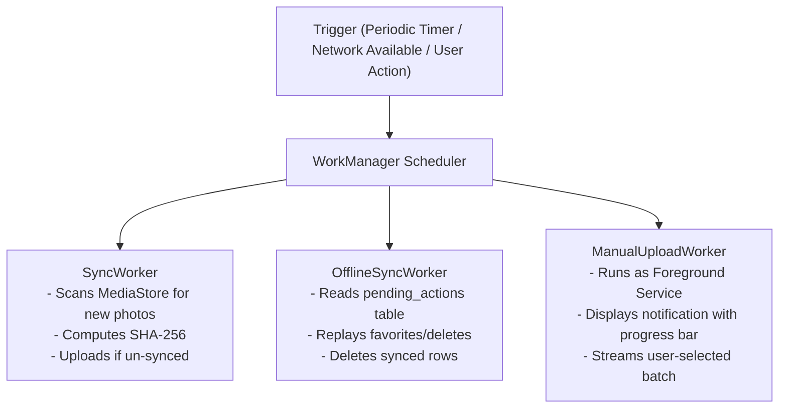

# Android Services & System Components — Chege Photos Android

This document details the core platform integrations of the Android application: zero-copy Okio streaming, 64 KB SHA-256 chunked hashing, WorkManager background synchronization, Jetpack Compose edge-to-edge layout, and on-device ML Kit face detection.

---

## 1. High-Performance Zero-Copy Streaming (`ContentUriRequestBody`)

Traditional Android multipart uploads read the entire file into a byte array in RAM (`ByteArrayOutputStream` or `file.readBytes()`), immediately causing **Out-Of-Memory (OOM)** crashes on 4K videos or RAW photos.

[ContentUriRequestBody.kt](../../app/src/main/java/com/niccher/chege_photos_app/utils/ContentUriRequestBody.kt) implements OkHttp's `RequestBody` interface using **Okio streaming**:

```kotlin
class ContentUriRequestBody(
    private val contentResolver: ContentResolver,
    private val uri: Uri,
    private val contentType: MediaType?
) : RequestBody() {

    override fun writeTo(sink: BufferedSink) {
        contentResolver.openInputStream(uri)?.use { inputStream ->
            val source = inputStream.source()
            sink.writeAll(source) // Direct pipe: ContentResolver stream -> OkHttp TCP socket
        }
    }
}
```

* **Memory Usage**: Constant memory footprint ($\le 64\text{ KB}$ internal buffer) regardless of file size.
* **Throughput**: Zero intermediate JVM allocations, enabling maximum upload throughput over Wi-Fi and 5G.

---

## 2. 64 KB Chunked Hashing (`HashUtils`)

To verify if an image already exists on the server without transferring the full binary, [HashUtils.kt](../../app/src/main/java/com/niccher/chege_photos_app/utils/HashUtils.kt) streams the file through a message digest in 64 KB chunks:

```kotlin
fun computeSha256(inputStream: InputStream): String {
    val digest = MessageDigest.getInstance("SHA-256")
    val buffer = ByteArray(65536) // 64 KB buffer
    var bytesRead: Int
    while (inputStream.read(buffer).also { bytesRead = it } != -1) {
        digest.update(buffer, 0, bytesRead)
    }
    return digest.digest().joinToString("") { "%02x".format(it) }
}
```

---

## 3. WorkManager Background Architecture

Background operations are executed by three specialized `CoroutineWorker` classes:



### Constraints
* **NetworkType**: `NetworkType.CONNECTED` (or `NetworkType.UNMETERED` when "Wi-Fi Only" is toggled).
* **Battery**: `setRequiresBatteryNotLow(true)` prevents background drains during critical battery levels.

---

## 4. Compose UI & Edge-to-Edge Window Insets

The application configures true edge-to-edge rendering in [MainActivity.kt](../../app/src/main/java/com/niccher/chege_photos_app/MainActivity.kt):

* **System Bar Translucency**: Uses `WindowCompat.setDecorFitsSystemWindows(window, false)`.
* **Cutout Awareness**: Applies `.statusBarsPadding()` and `.navigationBarsPadding()` so that fullscreen photo carousels extend behind the status and navigation bars without obscuring controls or captions.
* **Interactive Lightbox**: Supports pinch-to-zoom, double-tap zoom (1x to 3x), and two-finger pan with gesture velocity detection.

---

## 5. Local Face Detection (Google ML Kit)

In addition to server-side InsightFace processing, [LocalFaceDetector.kt](../../app/src/main/java/com/niccher/chege_photos_app/utils/LocalFaceDetector.kt) utilizes Google ML Kit for zero-latency on-device face bounding box detection:
* Operates locally without requiring network connectivity.
* Renders real-time bounding boxes and face highlights on the device screen while the photo is uploading.

---

## Related Documentation

* [Architecture Overview](../architecture/overview.md)
* [Data & Storage Models](../architecture/data-and-storage.md)
* [Network Communication](../architecture/communication.md)
* [Local Development Guide](../engineering/local-development.md)
